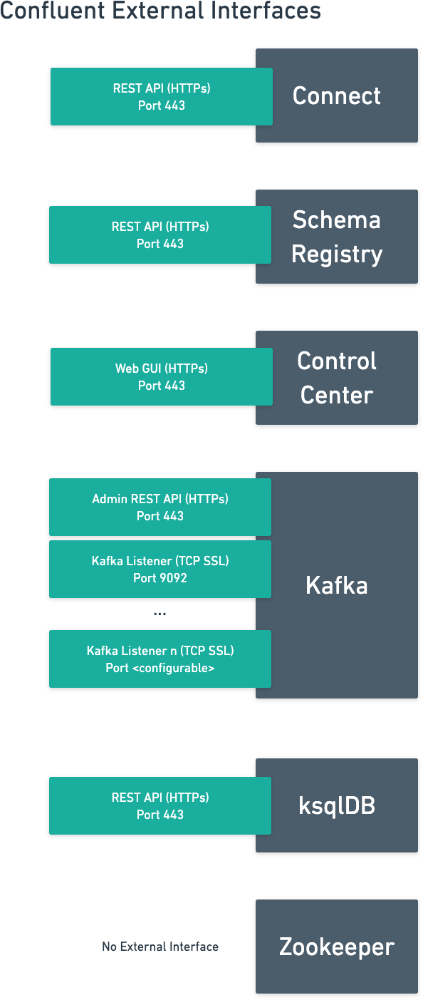
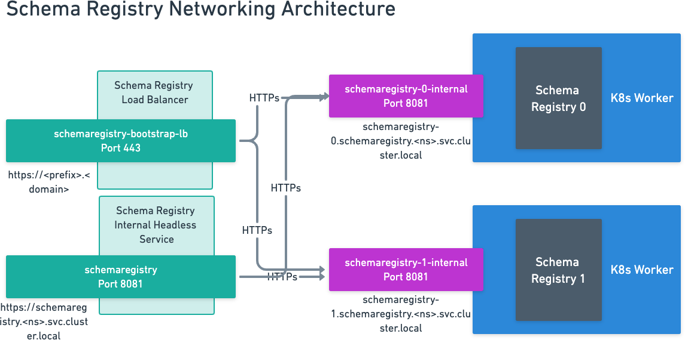
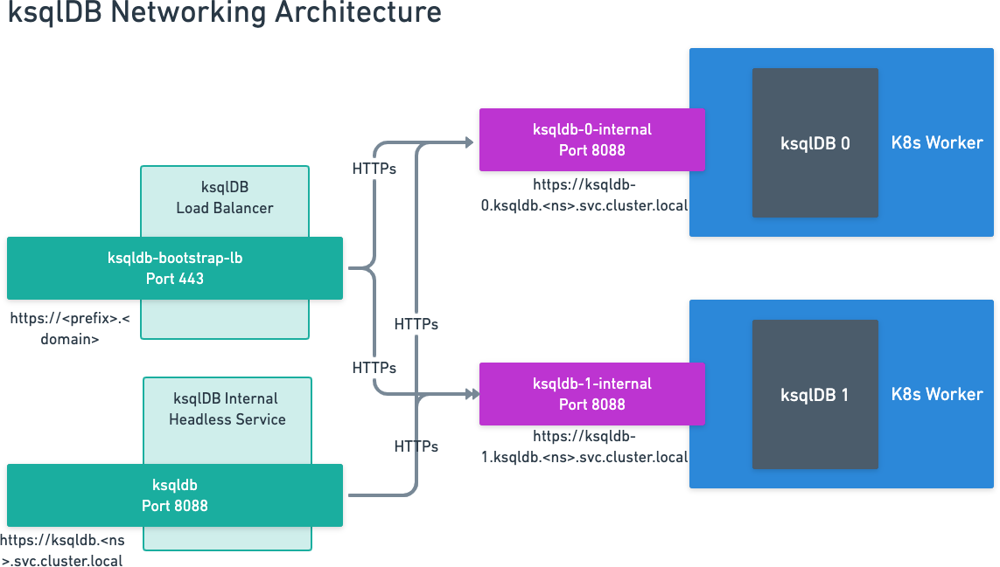
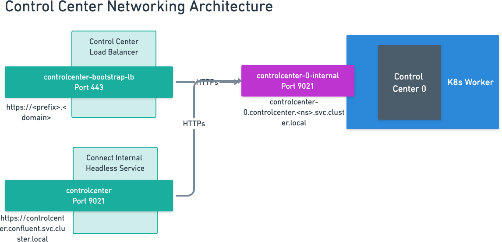

Networking for Confluent on Kubernetes
======================================

Confluent Platform has the following external interface points:

Each Confluent component can provide an external and internal interface.

Here's the list of all internal HTTP endpoints (`ns` is the `namespace` deployed to):

- Kafka Admin REST API: kafka.<ns>.svc.cluster.local:8090
- Connect REST API: connect.<ns>.svc.cluster.local:8083
- SchemaRegistry REST API: schemaregistry.<ns>.svc.cluster.local:8081
- ksqlDB REST API: ksqldb.<ns>.svc.cluster.local:8088
- Control Center Web GUI: controlcenter.<ns>.svc.cluster.local:9021

.. image:: ../images/connect-interfaces.png
   :width: 600px

