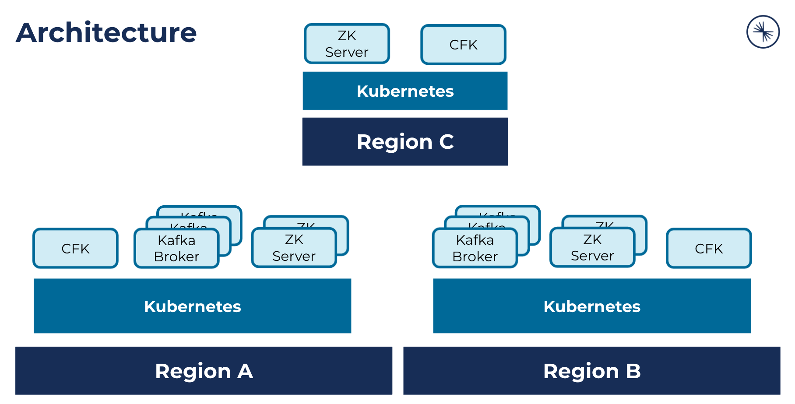

# Early Access: Confluent Multi-Region Clusters with Confluent for Kubernetes

Note: This is Early Access functionality.

Confluent Server is often run across availability zones or nearby datacenters. If the computer network between brokers across availability zones or nearby datacenters is dissimilar, in term of reliability, latency, bandwidth, or cost, this can result in higher latency, lower throughput and increased cost to produce and consume messages.

To mitigate this, Multi-Region Cluster functionality was added to Confluent Server. Read more about this functionality [here](https://docs.confluent.io/platform/current/multi-dc-deployments/multi-region.html).

In this scenario workflow, you'll understand the concepts and how to set up a Multi-region cluster.

export TUTORIAL_HOME=<Tutorial directory>/hybrid/multi-region-clusters

## Concepts

At a high level, you'll deploy Confluent for Kubernetes (CFK) and Confluent Platform across multiple Kubernetes clusters.



There are two key concepts to understand:

- Networking between Kubernetes clusters
- Confluent Server (Kafka) and Zookeeper deployment with Multi-Region cluster configuration

### Networking

To support Multi-Region Clusters with Confluent for Kubernetes, you'll need to meet the following requirements in your Kubernetes architecture:

- Pods in one Kubernetes cluster can resolve the internal Kubernetes network DNS names for pods in the other Kubernetes clusters
- Pods in one Kubernetes cluster can communicate with pods in the other Kubernetes clusters

There may be multiple ways to acheive these requirements. How you meeet these requirements will depend on your infrastructure setup and Kubernetes vendor. 
In this scenario documentation, you'll see one illustrative networking solution for these requirements you can follow along.

### Confluent Server (Kafka) and Zookeeper deployment

To support Multi-Region Clusters with Confluent for Kubernetes, you'll take the following steps:

- Deploy Confluent for Kubernetes to each region
- For Kafka
  - Deploy Kafka brokers to 2 regions
  - Configure the broker id offset to a different number in each region
  - Configure the Kafka cluster id as the same across all (point to the same Zookeeper)
- For Zookeeper
  - Deploy Zookeeper servers to 3 regions
  - Configure ZK server id offset to a different number in each region

## Set up - Networking

Depending on your environement, set up Kubernetes networking between the multiple clusters.

[Example for Google Kubernetes Engine](./networking-GKE-README.md)

## Set up - Deploy Confluent for Kubernetes

Deploy Confluent for Kubernetes to each Kubernetes cluster.

```
# Set up the Helm Chart

helm repo add confluentinc https://packages.confluent.io/helm

# Install Confluent For Kubernetes

helm upgrade --install cfk-operator confluentinc/confluent-for-kubernetes -n east --kube-context mrc-east

helm upgrade --install cfk-operator confluentinc/confluent-for-kubernetes -n west --kube-context mrc-west

helm upgrade --install cfk-operator confluentinc/confluent-for-kubernetes -n central --kube-context mrc-central
```

## Set up - Deploy Confluent Platform

In this step, you'll deploy:
- 3 Kafka brokers to the `west` region, and 3 Kafka brokers to the `east` region
  - Configure rack awareness so that partition placement can take broker region into account
- 3 Zookeeper servers to the `central` region

### Configure service account

In order for rack awareness to be configured, you'll need to use a service account that is configured with a clusterrole/role that provides get/list access to both the pods and nodes resources. This is required as Kafka pods will curl kubernetes api for the node it is scheduled on using the mounted serviceAccountToken.

```
kubectl apply -f $TUTORIAL_HOME/service-account-rolebinding-west.yaml --context mrc-west
kubectl apply -f $TUTORIAL_HOME/service-account-rolebinding-east.yaml --context mrc-east
```

### Deploy the clusters

Here, you'll deploy a Zookeeper cluster to the `central` region.
You'll deploy 2 Kafka clusters - one to `east` region and one to `west` region.

```
kubectl apply -f $TUTORIAL_HOME/confluent-platform-central.yaml --context mrc-central
kubectl apply -f $TUTORIAL_HOME/confluent-platform-west.yaml --context mrc-west
kubectl apply -f $TUTORIAL_HOME/confluent-platform-east.yaml --context mrc-east
```


## Tear down

```
kubectl delete -f $TUTORIAL_HOME/confluent-platform-central.yaml --context mrc-central
kubectl delete -f $TUTORIAL_HOME/confluent-platform-west.yaml --context mrc-west
kubectl delete -f $TUTORIAL_HOME/confluent-platform-east.yaml --context mrc-east

helm uninstall cfk-operator -n east --kube-context mrc-east
helm uninstall cfk-operator -n west --kube-context mrc-west
helm uninstall cfk-operator -n central --kube-context mrc-central
```


## Troubleshooting

### Check that Kafka is using the Zookeeper deployments

Look at the ZK nodes.

```
$ kubectl exec zookeeper-0 -it bash -n central --context mrc-central

bash-4.4$ zookeeper-shell 127.0.0.1:2181

ls /kafka-west/brokers/ids
[0, 1, 100, 101, 102, 2]

# You should see 6 brokers ^
```