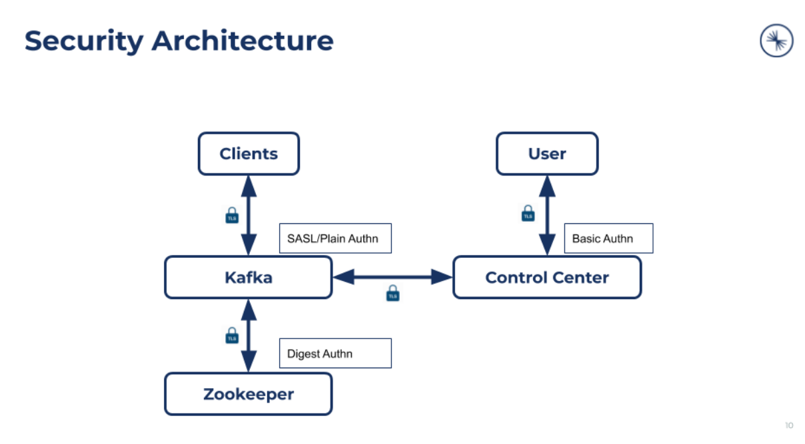

Deploy Secure Confluent Platform
================================

In this workflow scenario, you'll set up secure Confluent Platform clusters with
SASL_PLAIN authentication, no authorization, and inter-component TLS.

Before you begin this tutorial:

* Clone the Tutorial repo.

To complete this scenario, you'll follow these steps:

#. Set up a Kubernetes cluster for this tutorial.

#. Deploy Confluent Operator.

#. Deploy Confluent Platform.

#. Deploy the Producer application.

#. Tear down Confluent Platform.

===========================
Set up a Kubernetes cluster
===========================

Set up a Kubernetes cluster for this tutorial.

#. Add or get access to a Kubernetes cluster.

#. Create the namespace and set it to the current namespace. In this tutorial, we will deploy Confluent Platform in the ``confluent`` namespace.

   ::
   
     kubectl create namespace confluent
     
   ::

     kubectl config set-context --current --namespace=confluent

==================================
Set the current tutorial directory
==================================

Set the tutorial directory for this tutorial under the directory you downloaded
the tutorial files:

::
   
  export TUTORIAL_HOME=<Tutorial directory>/secure-authz-encrypt-deploy

=========================
Deploy Confluent Operator
=========================

The assumption is that you’ve set up Early Access credentials following <link>.

#. Install Confluent Operator using Helm:

   ::

     helm upgrade --install operator confluentinc/confluent-operator
  
#. Check that the Confluent Operator pod comes up and is running:

   ::
     
     kubectl get pods

============================
Deploy configuration secrets
============================

You'll use Kubernetes secrets to provide credential configurations.

With Kubernetes secrets, credential management (defining, configuring, updating)
can be done outside of the Confluent Operator. You define the configuration
secret, and then tell Confluent Operator where to find the configuration.

In this tutorial, you will deploy a secure Zookeeper, Kafka and Control Center,
and the rest of Confluent Platform components as shown below:

   
To support the above deployment scenario, you need to provide the following
credentials:

* Root Certificate Authority to auto-generated certificates

* Authentication credentials for Zookeeper, Kafka, and Control Center

Provide a Root Certificate Authority
^^^^^^^^^^^^^^^^^^^^^^^^^^^^^^^^^^^^

Confluent Operator provides auto-generated certificates for Confluent Platform
components to use for inter-component TLS. You'll need to generate and provide a
Root Certificate Authority (CA).

#. Generate a CA pair to use:

   ::

     openssl genrsa -out ca-key.pem 2048
    
   ::

     openssl req -new -key ca-key.pem -x509 \
       -days 1000 \
       -out ca.pem \
       -subj "/C=US/ST=CA/L=MountainView/O=Confluent/OU=Opeator/CN=TestCA"

#. Create a Kuebernetes secret for inter-component TLS:

   ::

     kubectl create secret tls ca-pair-sslcerts --cert=ca.pem --key=ca-key.pem
  
Provide authentication credentials
^^^^^^^^^^^^^^^^^^^^^^^^^^^^^^^^^^

Create a Kubernetes secret object that contains file based properties. These
files are in the format that each respective Confluent component requires for
authentication credentials.

#. Create secrets object for Zookeeper, Kafka, and Control Center:

   ::

     kubectl create secret generic credential \
     --from-file=plain-users.json=creds-kafka-sasl-users.json \
     --from-file=digest-users.json=creds-zookeeper-sasl-digest-users.json \
     --from-file=digest.txt=creds-kafka-zookeeper-credentials.txt \
     --from-file=plain.txt=creds-client-kafka-sasl-user.txt \
     --from-file=basic.txt=creds-control-center-users.txt

In this tutorial, we use one credential for authenticating all client and server
communication to Kafka brokers. In production scenarios, you'll want to specify
different credentials for each of them.

========================================
Review Confluent Platform configurations
========================================

You install Confluent Platform components as custom resources (CRs). 

The Confluent Platform components are configured in one file for secure
authentication and encryption for:
``$TUTORIAL_HOME/confluent-platform-secure.yaml``

Let's take a look at how these components are configured.

* Configure SASL/Plain authentication for Kafka, with a pointer to the externally managed secrets object for credentials:

  ::
  
    spec:
      listeners:
        internal:
          authentication:
            type: plain
            jaasConfig:
              secretRef: credential
          tls:
            enabled: true

* Configure SASL/Plain authentication to Kafka for other components, using a pointer to the externally managed secrets object for credentials:
 
  ::
  
    spec:
      dependencies:
        kafka:
          bootstrapEndpoint: kafka.confluent.svc.cluster.local:9071
          authentication:
            type: plain
            jaasConfig:
              secretRef: credential
          tls:
            enabled: true

* Configure auto generated certificates for all server components:

  :: 
  
    spec:
      tls:
        autoGeneratedCerts: true
  
=========================
Deploy Confluent Platform
=========================

#. Deploy Confluent Platform with the above configuration:

   ::

     kubectl apply -f $TUTORIAL_HOME/confluent-platform-secure.yaml

#. Check that all Confluent Platform resources are deployed:

   ::
   
     kubectl get confluent

#. Get the status of any component. For example, to check Kafka:

   ::
   
     kubectl describe kafka

=============================
Provide client configurations
=============================

You'll need to provide the client configurations to use. This can be provided as
a Kubernetes secret that client applications can use.

#. Get status:

   ::
   
     kubectl describe kafka
  
#. Copy the internal client configs - Internal.Client - from Kafka status, add credentials:
  
   ::
   
     bootstrap.servers=kafka.confluent.svc.cluster.local:9071
     sasl.jaas.config=org.apache.kafka.common.security.plain.PlainLoginModule required username=kafka_client password=kafka_client-secret;
     sasl.mechanism=PLAIN
     security.protocol=SASL_SSL
     ssl.truststore.location=/mnt/sslcerts/truststore.jks
     ssl.truststore.password=mystorepassword

#. Take the client properties and create a configuration secret for client applications to use:

   ::

     vi kafka.properties

     kubectl create secret generic kafka-client-config-secure \
       --from-file=kafka.properties \
  
========
Validate
========

Deploy the producer application
^^^^^^^^^^^^^^^^^^^^^^^^^^^^^^^

Now that we've got the infrastructure set up, let's deploy the producer client
app.

The producer app is packaged and deployed as a pod on Kubernetes. The required
topic is defined as a KafkaTopic custom resource in
``$TUTORIAL_HOME/secure-producer-app-data.yaml``.

This app takes the above client configuration as a Kubernetes secret. The secret
is mounted to the app pod file system, and the client application reads the
configuration as a file.

::

  kubectl apply -f $TUTORIAL_HOME/secure-producer-app-data.yaml

Validate in Control Center
^^^^^^^^^^^^^^^^^^^^^^^^^^

Use Control Center to monitor the Confluent Platform, and see the created topic
and data.

#. Set up port forwarding to Control Center web UI from local machine:

::

  kubectl port-forward controlcenter-0 9021:9021

#. Log into Control Center and view the brokers, and the created topic. See that messages are being produced to this topic.

=========
Tear down
=========

::

  kubectl delete -f secure-producer-app-data.yaml

::

  kubectl delete -f confluent-platform-secure.yaml

::

  kubectl delete secret kafka-client-config-secure

::

  kubectl delete secret credential

::

  kubectl delete secret ca-pair-sslcerts

::

  helm delete operator
  
::
  
  kubectl delete ns confluent

